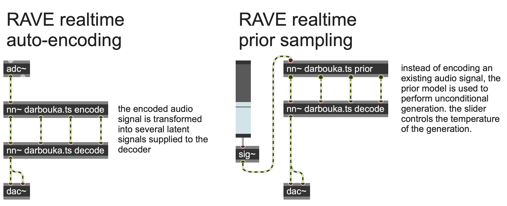

# RAVE: Realtime Audio Variational autoEncoder

Official implementation of _RAVE: A variational autoencoder for fast and high-quality neural audio synthesis_ ([article link](https://arxiv.org/abs/2111.05011)) by Antoine Caillon and Philippe Esling.

If you use RAVE as a part of a music performance or installation, be sure to cite either this repository or the article !

## Colab

We propose a Google Colab handling the training of a RAVE model on a custom dataset !

[](https://colab.research.google.com/drive/1aK8K186QegnWVMAhfnFRofk_Jf7BBUxl?usp=sharing)

## Installation

RAVE needs `python 3.9`. Install the dependencies using

```bash
pip install -r requirements.txt
```

Detailed instructions to setup a training station for this project are available [here](docs/training_setup.md).

## Preprocessing

RAVE comes with two command line utilities, `resample` and `duration`. `resample` allows to pre-process (silence removal, loudness normalization) and augment (compression) an entire directory of audio files (.mp3, .aiff, .opus, .wav, .aac). `duration` prints out the total duration of a .wav folder.

## Training

Both RAVE and the prior model are available in this repo. For most users we recommand to use the `cli_helper.py` script, since it will generate a set of instructions allowing the training and export of both RAVE and the prior model on a specific dataset.

```bash
python cli_helper.py
```

However, if you want to customize even more your training, you can use the provided `train_{rave, prior}.py` and `export_{rave, prior}.py` scripts manually.

## Reconstructing audio

Once trained, you can reconstruct an entire folder containing wav files using

```bash
python reconstruct.py --ckpt /path/to/checkpoint --wav-folder /path/to/wav/folder
```

You can also export RAVE to a `torchscript` file using `export_rave.py` and use the `encode` and `decode` methods on tensors.

## Realtime usage

**UPDATE**

If you want to use the realtime mode, you should update your dependencies !

```bash
pip install -r requirements.txt
```

RAVE and the prior model can be used in realtime on live audio streams, allowing creative interactions with both models.

### [nn~](https://github.com/acids-ircam/nn_tilde)

RAVE is compatible with the **nn~** max/msp and PureData external.



An audio example of the prior sampling patch is available in the `docs/` folder.

### [RAVE vst](https://github.com/acids-ircam/rave_vst)

You can also use RAVE as a VST audio plugin using the RAVE vst !


## Discussion

If you have questions, want to share your experience with RAVE or share musical pieces done with the model, you can use the [Discussion tab](https://github.com/acids-ircam/RAVE/discussions) !

## Demonstation

### RAVE x nn~

Demonstration of what you can do with RAVE and the nn~ external for maxmsp !

[](https://www.youtube.com/watch?v=dMZs04TzxUI)

### embedded RAVE

Using nn~ for puredata, RAVE can be used in realtime on embedded platforms !

[](https://www.youtube.com/watch?v=jAIRf4nGgYI)
