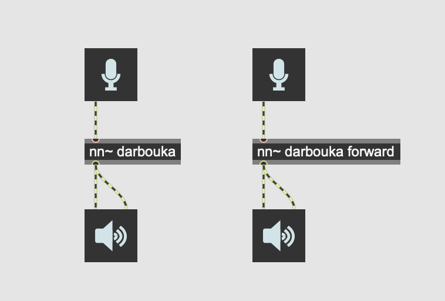
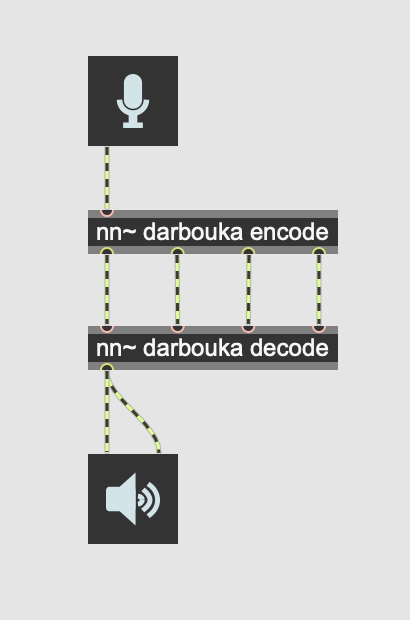
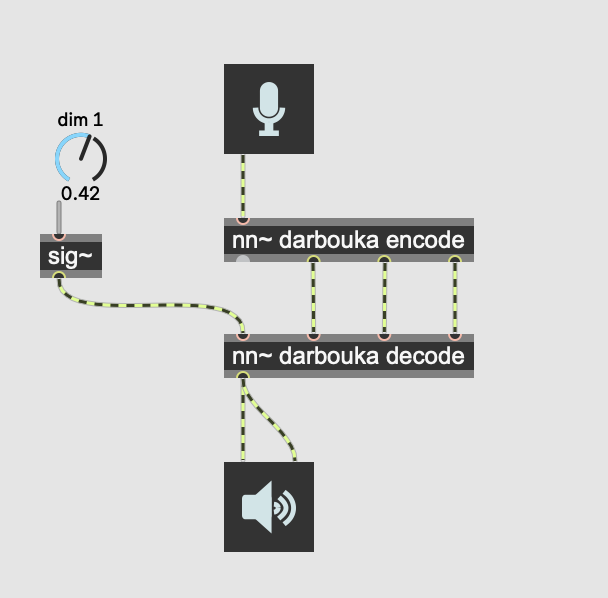
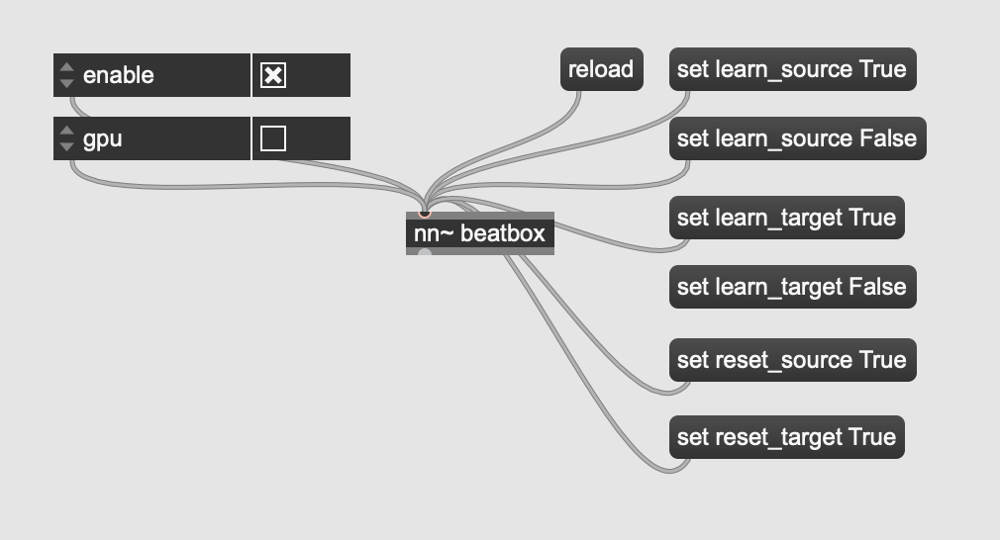

# RAVE: Realtime Audio Variational autoEncoder

Official implementation of _RAVE: A variational autoencoder for fast and high-quality neural audio synthesis_ ([article link](https://arxiv.org/abs/2111.05011)) by Antoine Caillon and Philippe Esling.

If you use RAVE as a part of a music performance or installation, be sure to cite either this repository or the article !

If you want to share / discuss / ask things about RAVE you can do so in our [discord server](https://discord.gg/dhX73sPTBb) !

## Previous versions

The original implementation of the RAVE model can be restored using

```bash
git checkout v1
```

## Installation

Install RAVE using

```bash
pip install acids-rave
```

You will need **ffmpeg** on your computer. You can install it locally inside your virtual environment using

```bash
conda install ffmpeg
```

<!-- Detailed instructions to setup a training station for this project are available [here](docs/training_setup.md). -->

## Colab

A colab to train RAVEv2 is now available thanks to [hexorcismos](https://github.com/moiseshorta) !
[](https://colab.research.google.com/drive/1ih-gv1iHEZNuGhHPvCHrleLNXvooQMvI?usp=sharing)

## Usage

Training a RAVE model usually involves 3 separate steps, namely _dataset preparation_, _training_ and _export_.

### Dataset preparation

You can know prepare a dataset using two methods: regular and lazy. Lazy preprocessing allows RAVE to be trained directly on the raw files (i.e. mp3, ogg), without converting them first. **Warning**: lazy dataset loading will increase your CPU load by a large margin during training, especially on Windows. This can however be useful when training on large audio corpus which would not fit on a hard drive when uncompressed. In any case, prepare your dataset using

```bash
rave preprocess --input_path /audio/folder --output_path /dataset/path (--lazy)
```

### Training

RAVEv2 has many different configurations. The improved version of the v1 is called `v2`, and can therefore be trained with

```bash
rave train --config v2 --db_path /dataset/path --out_path /model/out --name give_a_name
```

We also provide a discrete configuration, similar to SoundStream or EnCodec

```bash
rave train --config discrete ...
```

By default, RAVE is built with non-causal convolutions. If you want to make the model causal (hence lowering the overall latency of the model), you can use the causal mode

```bash
rave train --config discrete --config causal ...
```

New in 2.3, data augmentations are also available to improve the model's generalization in low data regimes. You can add data augmentation by adding augmentation configuration files with the `--augment` keyword

```bash
rave train --config v2 --augment mute --augment compress 
```

Many other configuration files are available in `rave/configs` and can be combined. Here is a list of all the available configurations & augmentations :

<table>
<thead>
<tr>
<th>Type</th>
<th>Name</th>
<th>Description</th>
</tr>
</thead>
<tbody>

<tr>
<td rowspan=8>Architecture</td>
<td>v1</td>
<td>Original continuous model</td>
</tr>

<tr>
<td>v2</td>
<td>Improved continuous model (faster, higher quality)</td>
</tr>

<tr>
<td>v2_small</td>
<td>v2 with a smaller receptive field, adpated adversarial training, and noise generator, adapted for timbre transfer for stationary signals</td>
</tr>

<tr>
<td>v2_nopqmf</td>
<td>(experimental) v2 without pqmf in generator (more efficient for bending purposes)</td>
</tr>

<tr>
<td>v3</td>
<td>v2 with Snake activation, descript discriminator and Adaptive Instance Normalization for real style transfer</td>
</tr>

<tr>
<td>discrete</td>
<td>Discrete model (similar to SoundStream or EnCodec)</td>
</tr>

<tr>
<td>onnx</td>
<td>Noiseless v1 configuration for onnx usage</td>
</tr>

<tr>
<td>raspberry</td>
<td>Lightweight configuration compatible with realtime RaspberryPi 4 inference</td>
</tr>

<tr>
<td rowspan=3>Regularization (v2 only)</td>
<td>default</td>
<td>Variational Auto Encoder objective (ELBO)</td>
</tr>

<tr>
<td>wasserstein</td>
<td>Wasserstein Auto Encoder objective (MMD)</td>
</tr>

<tr>
<td>spherical</td>
<td>Spherical Auto Encoder objective</td>
</tr>

<tr>
<td rowspan=1>Discriminator</td>
<td>spectral_discriminator</td>
<td>Use the MultiScale discriminator from EnCodec.</td>
</tr>

<tr>
<td rowspan=2>Others</td>
<td>causal</td>
<td>Use causal convolutions</td>
</tr>

<tr>
<td>noise</td>
<td>Enable noise synthesizer V2</td>
</tr>


<tr>
<td rowspan=3>Augmentations</td>
<td>mute</td>
<td>Randomly mutes data batches (default prob : 0.1). Enforces the model to learn silence</td>
</tr>

<tr>
<td>compress</td>
<td>Randomly compresses the waveform (equivalent to light non-linear amplification of batches)</td>
</tr>

<tr>
<td>gain</td>
<td>Applies a random gain to waveform (default range : [-6, 3]) </td>
</tr>

</tbody>
</table>

### Export

Once trained, export your model to a torchscript file using

```bash
rave export --run /path/to/your/run (--streaming)
```

Setting the `--streaming` flag will enable cached convolutions, making the model compatible with realtime processing. **If you forget to use the streaming mode and try to load the model in Max, you will hear clicking artifacts.**

## Prior
For discrete models, we redirect the user to the `msprior` library [here](https://github.com/caillonantoine/msprior). However, as this library is still experimental, the prior from version 1.x has been re-integrated in v2.3.

### Training
To train a prior for a pretrained RAVE model : 
```bash
rave train_prior --model /path/to/your/run --db_path /path/to/your_preprocessed_data --out_path /path/to/output
```
this will train a prior over the latent of the pretrained model `path/to/your/run`, and save the model and tensorboard logs to folder `/path/to/output`.

### Scripting
To script a prior along with a RAVE model, export your model by providing the `--prior` keyword to your pretrained prior :
```bash
rave export --run /path/to/your/run --prior /path/to/your/prior (--streaming)
```
## Pretrained models

Several pretrained streaming models [are available here](https://acids-ircam.github.io/rave_models_download). We'll keep the list updated with new models.

## Realtime usage

This section presents how RAVE can be loaded inside [`nn~`](https://acids-ircam.github.io/nn_tilde/) in order to be used live with Max/MSP or PureData.

### Reconstruction

A pretrained RAVE model named `darbouka.gin` available on your computer can be loaded inside `nn~` using the following syntax, where the default method is set to forward (i.e. encode then decode)



This does the same thing as the following patch, but slightly faster.




### High-level manipulation

Having an explicit access to the latent representation yielded by RAVE allows us to interact with the representation using Max/MSP or PureData signal processing tools:



### Style transfer

By default, RAVE can be used as a style transfer tool, based on the large compression ratio of the model. We recently added a technique inspired from StyleGAN to include Adaptive Instance Normalization to the reconstruction process, effectively allowing to define *source* and *target* styles directly inside Max/MSP or PureData, using the attribute system of `nn~`.



Other attributes, such as `enable` or `gpu` can enable/disable computation, or use the gpu to speed up things (still experimental).

## Offline usage

A batch generation script has been released in v2.3 to allow transformation of large amount of files

```bash
rave generate model_path path_1 path_2 --out out_path
```

where `model_path` is the path to your trained model (original or scripted), `path_X` a list of audio files or directories, and `out_path` the out directory of the generations.


## Discussion

If you have questions, want to share your experience with RAVE or share musical pieces done with the model, you can use the [Discussion tab](https://github.com/acids-ircam/RAVE/discussions) !

## Demonstration

### RAVE x nn~

Demonstration of what you can do with RAVE and the nn~ external for maxmsp !

[](https://www.youtube.com/watch?v=dMZs04TzxUI)

### embedded RAVE

Using nn~ for puredata, RAVE can be used in realtime on embedded platforms !

[](https://www.youtube.com/watch?v=jAIRf4nGgYI)

# Funding

This work is led at IRCAM, and has been funded by the following projects

- [ANR MakiMono](https://acids.ircam.fr/course/makimono/)
- [ACTOR](https://www.actorproject.org/)
- [DAFNE+](https://dafneplus.eu/) N° 101061548


