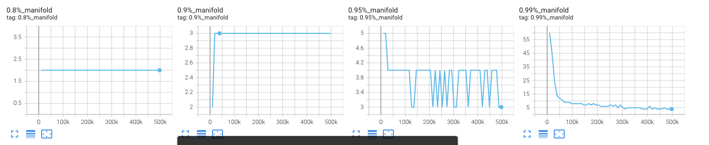
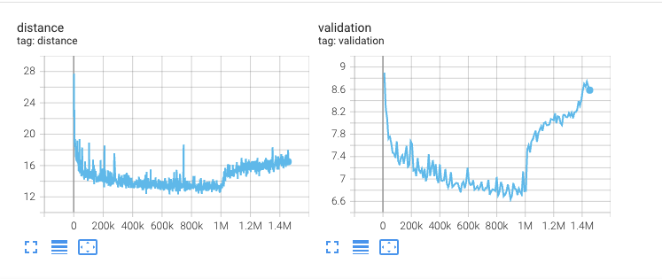
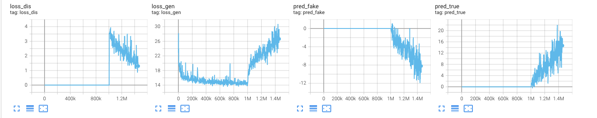

# Tensorboard guide

## Latent space size estimation

During training, RAVE regularly estimates the **size** of the latent space given a specific dataset for a given *fidelity*. The fidelity parameter is a percentage that defines how well the model should be able to reconstruct an input audio sample.

Usually values around 80% yield correct yet not accurate reconstructions. Values around 95% are most of the time sufficient to have both a compact latent space and correct reconstructions.

We log the estimated size of the latent space for several values of fidelity in tensorboard (80, 90, 95 and 99%). 

## Reconstrution error

The values you should look at for tracking the reconstruction error of the model are the *distance* and *validation* logs

When the 2 phase kicks in, those values increase - **that's usually normal**

## Adversarial losses

The `loss_dis, loss_gen, pred_true, pred_fake` losses only appear during the second phase. They are usually harder to read, as most of GAN losses are, bu we include here an example of what *normal* logs should look like

