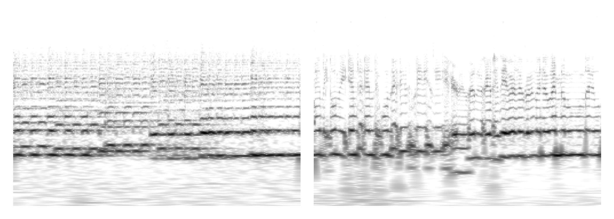
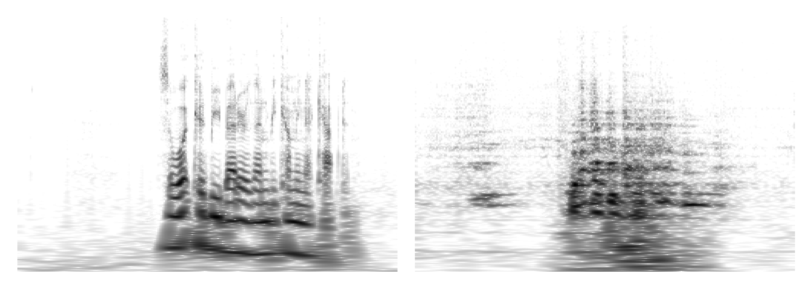
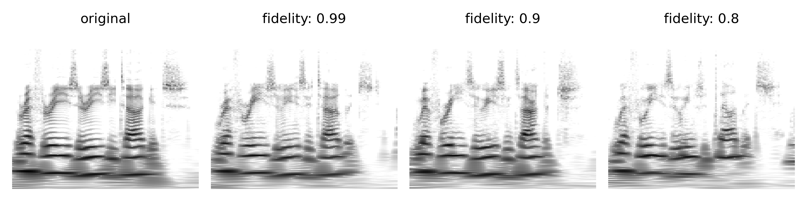
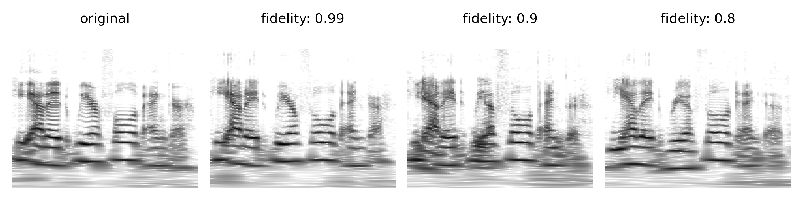
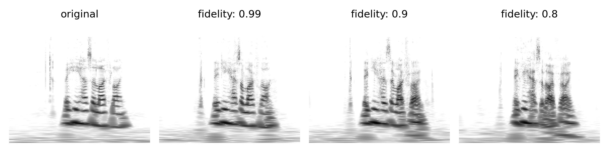
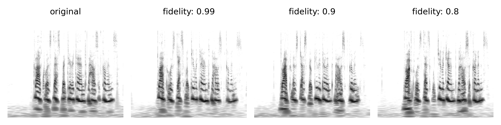

# RAVE: A variational autoencoder for fast and high-quality neural audio synthesis

**Abstract**: Deep generative models applied to audio have improved by a large margin the state-of-the-art in many speech and music related tasks. However, as raw waveform modelling remains an inherently difficult task, audio generative models are either computationally intensive, rely on low sampling rates, are complicated to control or restrict the nature of possible signals. Among those models, Variational AutoEncoders (VAE) give control over the generation by exposing latent variables, although they usually suffer from low synthesis quality. In this paper, we introduce a Realtime Audio Variational autoEncoder (RAVE) allowing both fast and high-quality audio waveform synthesis. We introduce a novel two-stage training procedure, namely representation learning and adversarial fine-tuning. We show that using a post-training analysis of the latent space allows a direct control between the reconstruction fidelity and the representation compactness. By leveraging a multi-band decomposition of the raw waveform, we show that our model is the first able to generate 48kHz audio signals, while simultaneously running 20 times faster than real-time on a standard laptop CPU. We evaluate synthesis quality using both quantitative and qualitative subjective experiments and show the superiority of our approach compared to existing models. Finally, we present applications of our model for timbre transfer and signal compression. All of our source code and audio examples are publicly available.

## Timbre transfer

Given the high compression applied to the input waveform when encoded into a latent representation, we demonstrate that RAVE can be used to perform timbre transfer.

### Strings to speech transfer

| original                                                                | reconstructed                                                           |
| ----------------------------------------------------------------------- | ----------------------------------------------------------------------- |
| <audio src="eval_timbre_2/x.mp3" controls style="width: 200px"></audio> | <audio src="eval_timbre_2/y.mp3" controls style="width: 200px"></audio> |

### Speech to strings transfer

| original                                                                | reconstructed                                                           |
| ----------------------------------------------------------------------- | ----------------------------------------------------------------------- |
| <audio src="eval_timbre_1/x.mp3" controls style="width: 200px"></audio> | <audio src="eval_timbre_1/y.mp3" controls style="width: 200px"></audio> |

## Latent manipulation

One of the main advantages of using VAEs compared to other generative frameworks is that one can alter the reconstruction of a sample manipulating its latent representation, effectively transforming high-level attributes of the data.

Here, we show how modifying the first two dimensions of RAVE trained on darbouka impacts high-level attributes of the signal. Alteration 1 (resp. 2) has its first (resp. second) dimension set to a ramp linearly increasing from -2 to 2 over time.

| Source         | Audio                                             |
| -------------- | ------------------------------------------------- |
| Original audio | <audio src="audio/input.mp3" controls></audio>    |
| Reconstruction | <audio src="audio/no_alter.mp3" controls></audio> |
| Alteration 1   | <audio src="audio/dim1.mp3" controls></audio>     |
| Alteration 2   | <audio src="audio/dim2.mp3" controls></audio>     |

## Unconditional generation

We learn the prior distribution of RAVE trained on different datasets with a Wavenet inspired model. This allow to generate 48kHz audio unconditionally faster than realtime on CPU.
_Stereo_ generation is obtained by decoding two latent trajectories sampled from the same posterior distribution and mapping the obtained signals to the left and right channels.

|         Dataset         | Generation                                                   |
| :---------------------: | ------------------------------------------------------------ |
| **Darbouka** _(stereo)_ | <audio src="audio/docs_darbouka_prior.mp3" controls></audio> |
|    **VCTK** _(mono)_    | <audio src="audio/hierarchical.mp3" controls></audio>        |

## Balancing compactness and fidelity

We show the influence of the fidelity parameter _f_ on the reconstructed samples.

### Sample 1

| original                                                                         | f: 0.99                                                                             | f: 0.9                                                                              | f: 0.8                                                                              |
| -------------------------------------------------------------------------------- | ----------------------------------------------------------------------------------- | ----------------------------------------------------------------------------------- | ----------------------------------------------------------------------------------- |
| <audio src="eval_crop/eval_crop_1/x.mp3" controls style="width: 100px" ></audio> | <audio src="eval_crop/eval_crop_1/y_99.mp3" controls style="width: 100px" ></audio> | <audio src="eval_crop/eval_crop_1/y_90.mp3" controls style="width: 100px" ></audio> | <audio src="eval_crop/eval_crop_1/y_80.mp3" controls style="width: 100px" ></audio> |

### Sample 2

| original                                                                         | f: 0.99                                                                             | f: 0.9                                                                              | f: 0.8                                                                              |
| -------------------------------------------------------------------------------- | ----------------------------------------------------------------------------------- | ----------------------------------------------------------------------------------- | ----------------------------------------------------------------------------------- |
| <audio src="eval_crop/eval_crop_2/x.mp3" controls style="width: 100px" ></audio> | <audio src="eval_crop/eval_crop_2/y_99.mp3" controls style="width: 100px" ></audio> | <audio src="eval_crop/eval_crop_2/y_90.mp3" controls style="width: 100px" ></audio> | <audio src="eval_crop/eval_crop_2/y_80.mp3" controls style="width: 100px" ></audio> |

### Sample 3

| original                                                                         | f: 0.99                                                                             | f: 0.9                                                                              | f: 0.8                                                                              |
| -------------------------------------------------------------------------------- | ----------------------------------------------------------------------------------- | ----------------------------------------------------------------------------------- | ----------------------------------------------------------------------------------- |
| <audio src="eval_crop/eval_crop_3/x.mp3" controls style="width: 100px" ></audio> | <audio src="eval_crop/eval_crop_3/y_99.mp3" controls style="width: 100px" ></audio> | <audio src="eval_crop/eval_crop_3/y_90.mp3" controls style="width: 100px" ></audio> | <audio src="eval_crop/eval_crop_3/y_80.mp3" controls style="width: 100px" ></audio> |

### Sample 4

| original                                                                         | f: 0.99                                                                             | f: 0.9                                                                              | f: 0.8                                                                              |
| -------------------------------------------------------------------------------- | ----------------------------------------------------------------------------------- | ----------------------------------------------------------------------------------- | ----------------------------------------------------------------------------------- |
| <audio src="eval_crop/eval_crop_4/x.mp3" controls style="width: 100px" ></audio> | <audio src="eval_crop/eval_crop_4/y_99.mp3" controls style="width: 100px" ></audio> | <audio src="eval_crop/eval_crop_4/y_90.mp3" controls style="width: 100px" ></audio> | <audio src="eval_crop/eval_crop_4/y_80.mp3" controls style="width: 100px" ></audio> |

## Bonus: sampling from the prior distribution

### Violin

<audio src="random/prior_violin.mp3" controls ></audio>

### Speech

<audio src="random/prior_vctk.mp3" controls ></audio>

## Artistic uses

Since its release, RAVE has been used by several artists all around the world to create original pieces, and [we report some of their creations](community.md).
